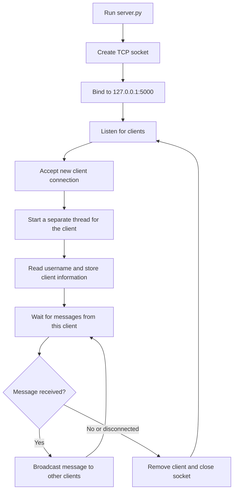
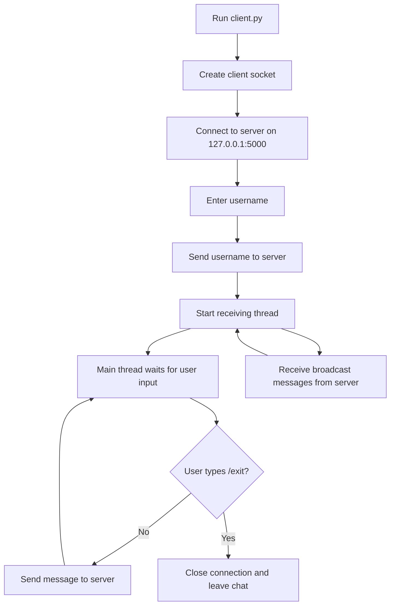

# Multi-Client Chat Application

A terminal-based real-time chat application built for a Computer Networks project. The system uses Python sockets for TCP communication and threads to support multiple connected clients at the same time.

## Project Objective

The goal of this project is to demonstrate how a simple client-server chat system works using core networking concepts:

- TCP socket communication.
- One central server that accepts many clients.
- A separate server thread for each connected client.
- Message broadcasting from one client to the other clients.
- Safe client disconnection without stopping the server.

## Assignment Requirements Coverage

| Requirement | Implementation |
| --- | --- |
| Server handles multiple simultaneous connections | `server.py` creates a new thread for every accepted client. |
| Client can send and receive messages | `client.py` has an input loop for sending and a background thread for receiving. |
| Messages are broadcast to other clients | The server `broadcast()` function sends each message to all clients except the sender. |
| Graceful exit | Clients can type `/exit`, and the server removes disconnected clients safely. |

## Technologies

- Python 3
- `socket` from the Python standard library
- `threading` from the Python standard library
- Command Prompt, PowerShell, Windows Terminal, VS Code terminal, or PyCharm terminal
- UTF-8 text encoding

No external packages are required.

## Project Structure

```text
.
|-- client.py
|-- server.py
`-- README.md
```

## Network Settings

Both files use the same local host and port:

```python
HOST = "127.0.0.1"
PORT = 5000
ENCODING = "utf-8"
```

`127.0.0.1` means the program runs locally on the same machine. This is the easiest setup for testing and recording the project demo.

## How the Application Works

The server starts a TCP socket, binds it to `127.0.0.1:5000`, and waits for incoming client connections. When a client connects, the server accepts the connection and creates a dedicated thread for that client.

Each client begins by sending a username. The server stores the client socket and username in a shared clients list. A lock is used around this list so that multiple threads do not update it at the same time.

When a client sends a message, the server receives it and broadcasts it to all other connected clients. The sender does not receive a copy of their own message.

The client also uses threading. One thread waits for messages from the server while the main program lets the user type and send messages. This makes the chat feel real-time because receiving and sending can happen at the same time.

## Application Flow Diagrams

The following diagrams summarize the project workflow from both the server side and the client side.

### Overall Message Flow


### Server-Side Flow



### Client-Side Flow



## How to Run

Open three terminal windows in the project folder.

Terminal 1:

```bash
python server.py
```

Terminal 2:

```bash
python client.py
```

Terminal 3:

```bash
python client.py
```

On Windows, if `python` is not recognized, use:

```bash
py server.py
py client.py
```

Use different usernames, such as:

```text
Ahmad
Nourhan
```

To leave the chat from any client, type:

```text
/exit
```

## Demo Scenario

1. Start the server.
2. Start the first client and enter `Ahmad`.
3. Start the second client and enter `Nourhan`.
4. From Ahmad, send `Hello Nourhan`.
5. Nourhan should receive `Ahmad: Hello Nourhan`.
6. From Nourhan, send `Hi Ahmad`.
7. Ahmad should receive `Nourhan: Hi Ahmad`.
8. From Nourhan, type `/exit`.
9. The server should keep running, and Ahmad should remain connected.

## Important Files

### `server.py`

Responsible for:

- Creating the TCP server socket.
- Listening for clients.
- Starting one thread per client.
- Receiving messages from clients.
- Broadcasting messages to all other connected clients.
- Removing disconnected clients safely.

### `client.py`

Responsible for:

- Connecting to the server.
- Sending the username.
- Sending messages typed by the user.
- Receiving messages from the server in a background thread.
- Leaving the chat with `/exit`.

## Possible Improvements

- Add a graphical user interface.
- Add private messages between specific users.
- Add chat rooms.
- Save chat history to a file or database.
- Add authentication for usernames.
- Support running the server on another device in the same network.
